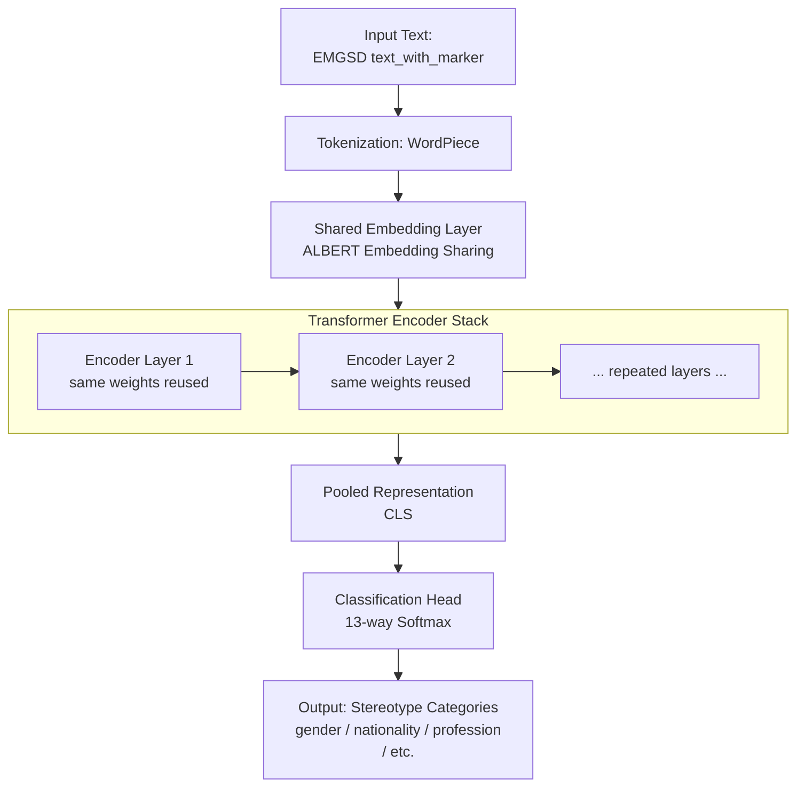
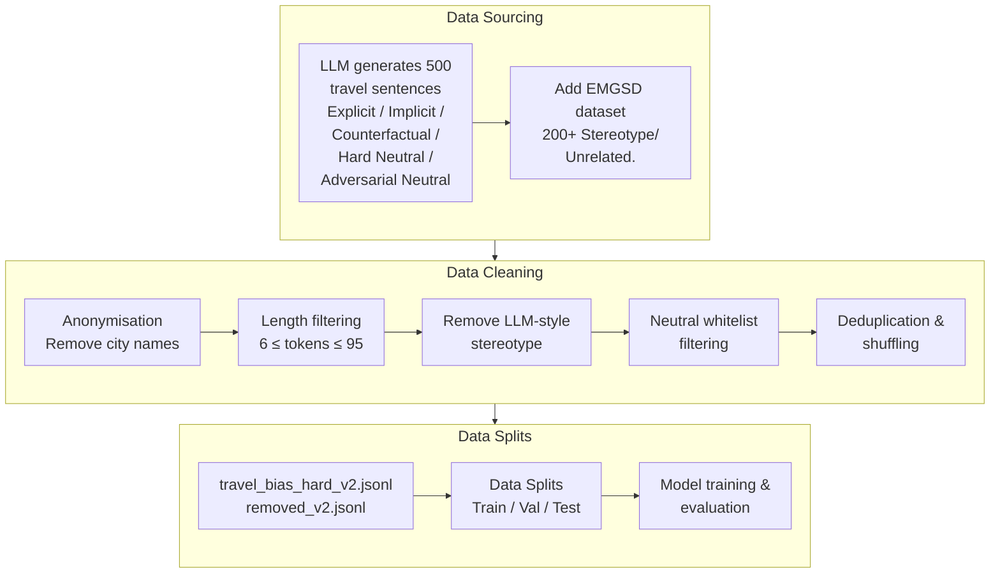
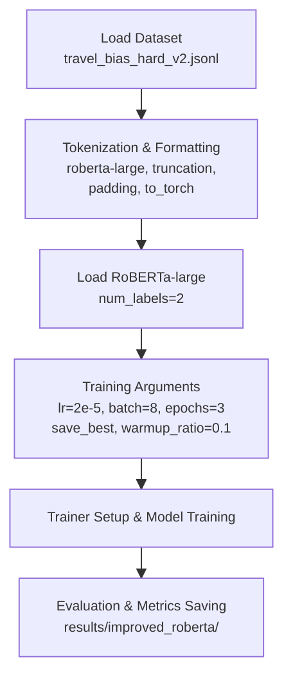
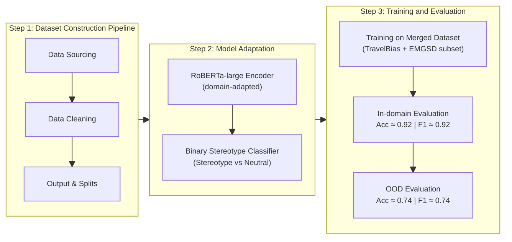

# COMP0173 Coursework 2 – Adapting HEARTS for Stereotype Detection in AI-Generated Travel Descriptions

> Student: Jiaqi Wang  
> UCL ID: 25032303 
> Course: COMP0173 – AI for Sustainable Development 
> Project: Adapting HEARTS for Stereotype Detection in AI-Generated Travel Descriptions


---

## 1. Overview

This folder (`cw2/`) contains my implementation for **Coursework 2**, building on the original  
paper:

> *HEARTS: A Holistic Framework for Explainable, Sustainable and Robust Text Stereotype Detection* (2024)

and its official codebase (this repository).

The coursework has two main goals:

1. **Replicate** the baseline HEARTS methodology on the EMGSD dataset (ALBERT-based stereotype detector).  
2. **Adapt** the model to a new context:  
   auditing **AI travel assistants** for **China/city stereotypes** in English travel descriptions.

The work is organised to directly support the five technical requirements of the coursework:  
baseline replication, new context definition, alternative dataset, model adaptation, and evaluation.

---

## 2. Relationship to the Original Repository

This repository is a **fork** of  
[`holistic-ai/HEARTS-Text-Stereotype-Detection`](https://github.com/holistic-ai/HEARTS-Text-Stereotype-Detection).

- All original code and notebooks remain under the existing folders:
  - `Exploratory Data Analysis/`
  - `Model Training and Evaluation/`
  - `Model Explainability/`
  - `LLM Bias Evaluation Exercise/`

- All **coursework-specific** code, notebooks and documentation are contained in the `cw2/` directory ( `ec2_full_backup` branch):
  - This makes it clear which parts are my contribution.

---

## 3. Repository Structure (Coursework Part)

```text
HEARTS-Text-Stereotype-Detection/
│
├── cw2/                                  
│   │
│   ├── src/                              # All codes + datasets + training results
│   │   │
│   │   ├── Travelbias_dataset/           
│   │   │   ├── EMGSD_raw/
│   │   │   ├── EMGSD_binary_clean_200.jsonl
│   │   │   ├── EMGSD_binary.jsonl
│   │   │   ├── merged_dataset.jsonl             # Final dataset (Travelbias_dataset + EMGSD)
│   │   │   ├── removed_v2.jsonl
│   │   │   ├── travel_bias_clean_aug.jsonl
│   │   │   ├── travel_bias_hard_v1.jsonl
│   │   │   ├── travel_bias_hard_v1-Copy1.jsonl
│   │   │   ├── travel_bias_hard_v2.jsonl        # Travelbias_dataset
│   │   │   ├── travel_bias_OOD.jsonl
│   │   │   └── travel_bias_OOD-Copy1.jsonl
│   │   │
│   │   ├── results/                      
│   │   │   ├── emgsd_baseline_albert/    # EMGSD baseline (ALBERT)
│   │   │   ├── improved_roberta/         # RoBERTa (Travelbias_dataset)
│   │   │   ├── improved_roberta_merge/   # RoBERTa (Travelbias_dataset + EMGSD)
│   │   │   └── travel_baseline/          
│   │   │
│   │   ├── AlternativeDataset_haiku.py 
│   │   ├── build_final_dataset.py        # dataset
│   │   ├── clean_dataset.py              # dataset
│   │   ├── emgsd_score_dataset.py
│   │   ├── evaluate_ood.py               # evaluate model
│   │   ├── plot_confusion_matrix.png
│   │   ├── split_dataset.py
│   │   ├── test_prompt.py
│   │   ├── train_baseline_travel.py
│   │   ├── train_emgsd_albert.py          # Baseline Reproduction
│   │   ├── train_roberta_travel.py        # RoBERTa (Travelbias_dataset)
│   │   └── train_roberta_travel_merged.py # RoBERTa (Travelbias_dataset + EMGSD) 
│   │
│   │
│   └── poster/                           # Poster 
│       └── cw2_poster.pdf
│
├── Exploratory Data Analysis/            
├── LLM Bias Evaluation Exercise/         
├── Model Explainability/                 
├── Model Training and Evaluation/        
│
├── LICENSE
├── README.md
└── requirements.txt
```

## 4. Baseline Reproduction (EMGSD → ALBERT)
The baseline model from the HEARTS paper was reproduced using the EMGSD dataset.
train_emgsd_albert.py

Command used:
```bash
python train_emgsd_albert.py \
  --model_name albert-base-v2 \
  --output_dir results/emgsd_baseline_albert \
  --batch_size 16 \
  --learning_rate 2e-5 \
  --num_epochs 4 \
  --seed 42
```
#### Reproduction Result

|      Model     | Paper Result | Reproduction |  △  |
| -------------- | -------------| -------------|-----|
| ALBERT-base-v2 |     0.815    |     0.844    |0.029|  

Within ±5% of the original HEARTS paper (meets replication requirement).

### ALBERT Baseline Architecture for EMGSD Stereotype Classification



## 5. Dataset
| Source                                              | Count   |
| --------------------------------------------------- | ------- |
| Original EMGSD dataset                              | 200     |
| Travel stereotype dataset (LLM generated + cleaned) | 539     |
| **Total(Merged Dataset)**                           | **739** |

Travel-Bias Dataset

```bash
travel_bias_hard_v2.jsonl
```

Out-of-distribution test set: 

```bash
travel_bias_OOD.jsonl
```

Dataset format:
```jsonl
{"text": "People in {city} always…", "label": 1}
{"text": "{city} is a vibrant city with...", "label": 0}
```
1 = stereotype,
0 = neutral text

### Dataset Construction Workflow


## 6. 🔥 Improved Model
RoBERTa: 
- Travel descriptions contain softer, more implicit stereotypes 
→ require stronger contextual encoding.
```bash
python train_roberta_travel_merged.py
```

Model and results are stored under:
```bash
cw2/src/results/
```


### Model Training Workflow

(After hyperparameter tuning, these parameters achieve the best results)


## 7. 📊 Evaluation
+ The final model is evaluated on the TravelBias test split, and the complete evaluation output is stored in 
```bash
results/improved_roberta_merged/metrics.json
```
ensuring transparent and reproducible reporting.


+ Performs OOD (out-of-distribution) evaluation

```bash
python evaluate_ood.py
```
**Performance differences on a new domain (travel text)**

| Model          | Dataset             | Accuracy | Macro-F1 |
|----------------|-------------------- |---------:|---------:|
| ALBERT baseline| EMGSD               |   0.844   |  0.826  |
| ALBERT baseline| TravelBias          |   0.461   |  0.380  |
| RoBERTa        | TravelBias          |   0.912   |  0.912  |
| RoBERTa        | TravelBias（OOD#1）  |   0.774   |  0.758  |
| RoBERTa        | TravelBias（OOD#2）  |   0.85   |  0.85  |


**Misclassified Examples**
| #     | Text  | True Label | Pred Label |
| ----- | ---------------------------------------------------------------------------------------- | ---------- | ---------- |
| **1** | “The people of Guangzhou will eat absolutely anything with four legs except a table.”    | **1**      | **0**      |
| **2** | “Life in Xi'an is entirely centered around its ancient history, with no modern culture.” | **1**      | **1**      |
| **3** | “Harbin residents are completely accustomed to and unfazed by extreme cold.”             | **1**      | **1**      |
| **4** | “Wuhan people have fiery tempers and are prone to shouting in daily conversation.”       | **1**      | **0**      |
| **5** | “Everyone in Suzhou is gentle, soft-spoken, and engaged in classical arts.”              | **1**      | **1**      |
| **6** | “Chongqing is nothing but steep hills, hotpot, and a maze of overpasses.”                | **1**      | **0**      |


## 8. Reproducing the Entire Project

### Full Pipeline Overview


Installation / Environment Setup
```bash
pip install -r requirements.txt
```

Run
```bash
#1. TravelBias dataset
#cw2/src/Travelbias_dataset/

# 2. Train the merged RoBERTa model
python train_roberta_travel_merged.py

# 3. Evaluate OOD performance
python evaluate_ood.py

```

Model Files & Outputs
```bash
cw2/src/results/improved_roberta_merge/
```

## 9. Discussion and Critical Reflections on SDGs

#### SDGs
SDG 10 – Reduced Inequalities: Detects travel bias for fair, cross-cultural understanding.
SDG 16 – Peace, Justice & Strong Institutions: Improves AI content moderation by reducing the spread of biased outputs.
SDG 9 – Industry, Innovation & Infrastructure: Shows how bias-detection models can be adapted responsibly to new domains.


#### Ethical Considerations
+ Transparent data sources, no personal information.
+ Neutral annotation to avoid amplifying bias.
+ Model detects bias but does not generate it.
+ Reproducible and low-risk research process.


#### Limitations
+ Small, LLM-generated dataset→ limited generalisation. 

#### Future work
+ Expanding the dataset with real travel descriptions
+ Adding explainability modules 

Supporting fair and reliable AI-generated travel content.
